# Agent Sudo – TryHackMe Write-up

## Overview

This repository documents the exploitation of the **Agent Sudo** TryHackMe room. The assessment focused on service enumeration, web application analysis, credential discovery, steganographic analysis, initial access, and Linux privilege escalation. The objective was to obtain root access by following a structured penetration testing methodology. 

---

## Objectives

- Enumerate exposed services
- Identify application misconfigurations
- Discover valid credentials
- Analyze hidden files and embedded data
- Gain initial SSH access
- Escalate privileges to root

---

## Lab Information

| Category | Details |
|----------|---------|
| Platform | TryHackMe |
| Room | Agent Sudo |
| Operating System | Ubuntu Linux |
| Difficulty | Easy |
| Focus Areas | Enumeration, Web Exploitation, Steganography, Password Cracking, Privilege Escalation |

---

<p align="center">
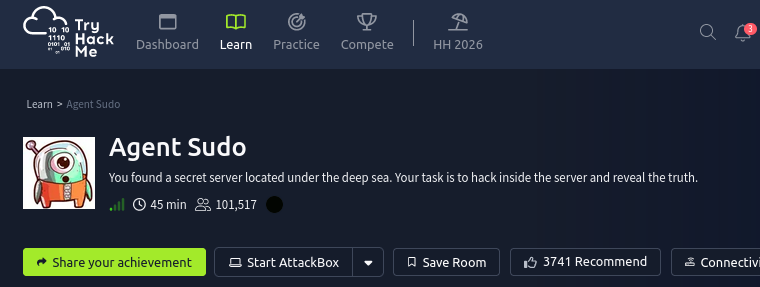
</p>

<p align="center">
<b>Figure.</b> Agent Sudo
</p>

# Enumeration

## Service Discovery

The first step was to identify the services exposed by the target.

### Command

```bash
nmap -sC -sV <TARGET_IP>
```

### Why Nmap?

Nmap is used to enumerate open ports, detect running services, and identify service versions. This establishes the initial attack surface before interacting with the target.

### Result

The scan identified the following services:

- HTTP
- FTP
- SSH
<p align="center">
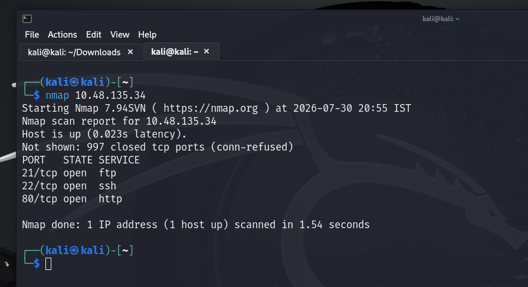
</p>

<p align="center">
<b>Figure.</b> Nmap Scan on target ip.
</p>
The HTTP web application displayed the following message:

```
Dear agents,

Use your own codename as user-agent to access the site.

From,
Agent R
```
<p align="center">
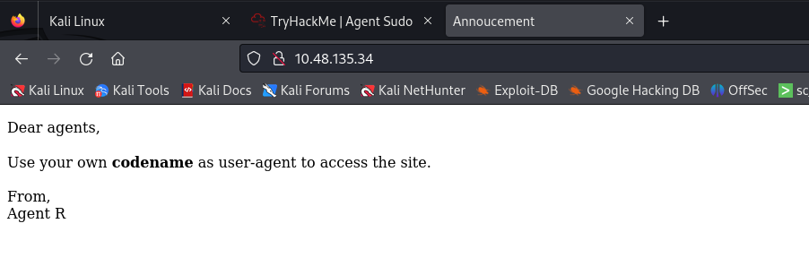
</p>

<p align="center">
<b>Figure.</b> Text displayed on the webpage of the target ip.
</p>

---

# User-Agent Enumeration

The webpage suggested that access depended on the HTTP User-Agent header.

## Why Burp Suite?

Burp Suite allows interception and modification of HTTP requests without changing the browser itself, making it suitable for testing request headers.

The intercepted request was sent to **Intruder**.

A payload containing characters from **A-Z** was used to brute-force the User-Agent header.

<p align="center">
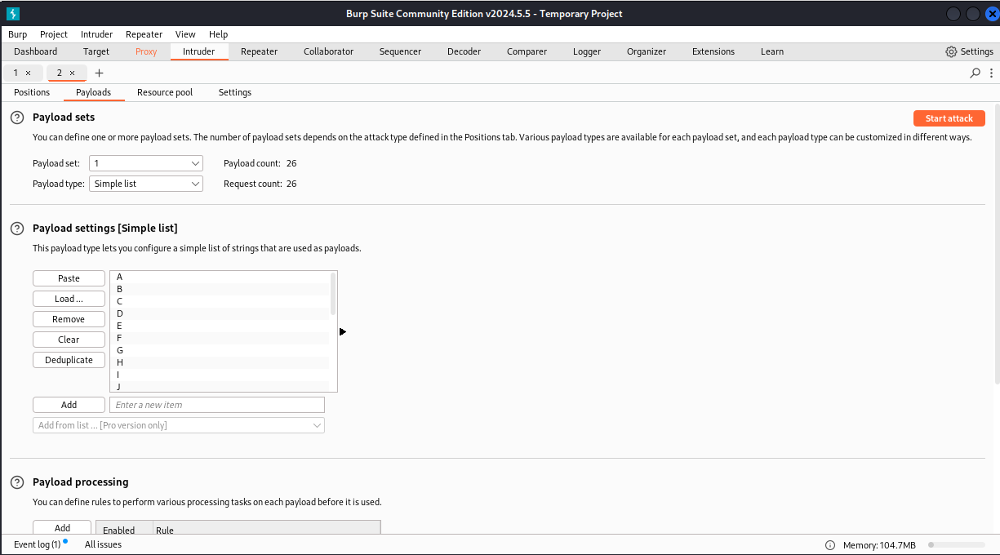
</p>

<p align="center">
<b>Figure 3.</b> Burp Suite intruder payload panel.
</p>

### Observation

<p align="center">
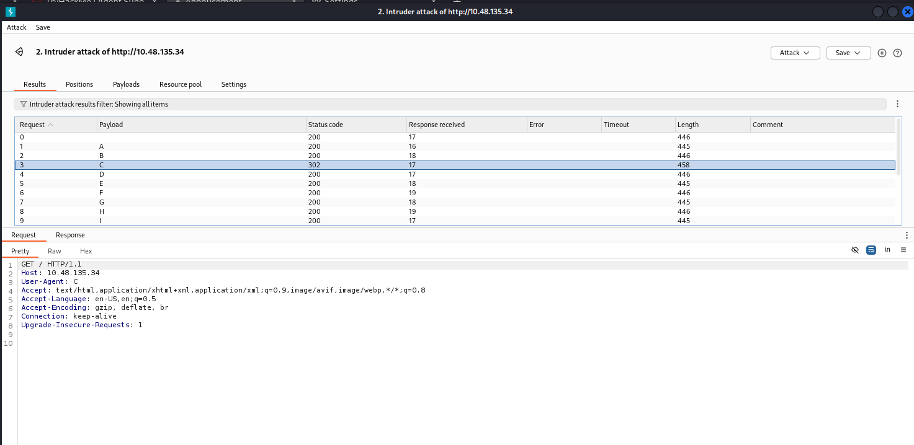
</p>

<p align="center">
<b>Figure.</b> intruder attack demonstration.
</p>

Most requests returned:

```
HTTP 200
```

One request returned:

```
HTTP 302
```

when the User-Agent value was:

```
C
```

A redirect indicated that the correct user-agent had been discovered.

The modified request was forwarded using **Repeater**, replacing the header with:

```
User-Agent: C
```
<p align="center">

</p>

<p align="center">
<b>Figure.</b> Text displayed on the webpage of the target ip.
</p>

From the Repeater these requests of user agent C are sent to the browser to view the information.

<p align="center">
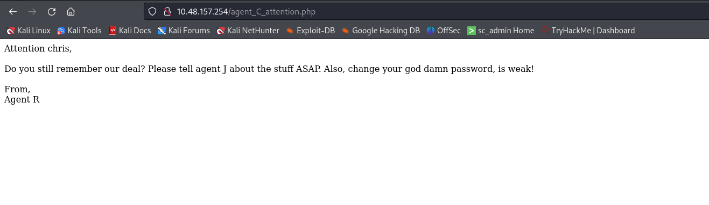
</p>

<p align="center">
<b>Figure.</b> USer Agent C page.
</p>

---

# FTP Enumeration

Anonymous FTP access was checked before attempting authentication.

### Command

```bash
nmap --script ftp-anon <TARGET_IP> -p 21
```

### Why ftp-anon?

The `ftp-anon` NSE script quickly verifies whether anonymous authentication is enabled on an FTP server.

### Result

Anonymous login was disabled.

---

# SSH Credential Brute Force

The webpage referenced an agent named **Chris**, suggesting a potential username.

The password appeared weak, making password brute forcing a reasonable approach.

## Why Hydra?

Hydra performs online password attacks against network authentication services.

### Command

```bash
hydra -l chris -P <WORDLIST> ssh://<TARGET_IP>
```

### Result

```
Username : chris
Password : crystal
```
<p align="center">
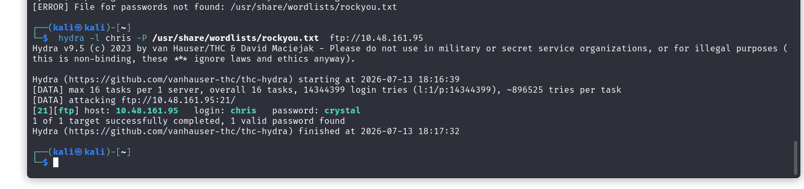
</p>

<p align="center">
<b>Figure.</b> Bruteforce attack.
</p>

---

# FTP File Retrieval

The recovered credentials were used to authenticate to the FTP server.

### Command

```bash
ftp <TARGET_IP>
```

```bash
get TO_agentJ.txt
get cute-alien.jpg
get cutie.png
```

### Downloaded Files

- TO_agentJ.txt
- cute-alien.jpg
- cutie.png

<p align="center">
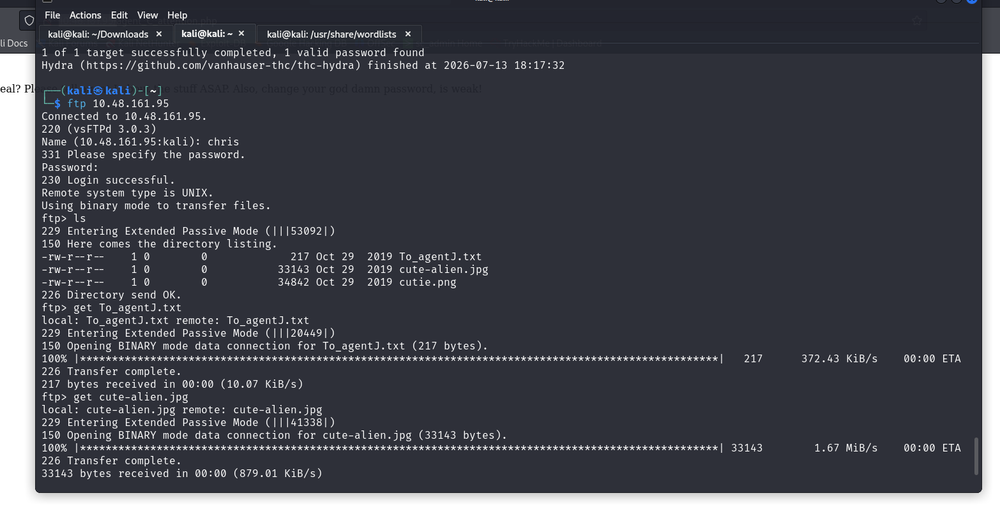
</p>

<p align="center">
<b>Figure.</b> FTP Service login.
</p>

<p align="center">
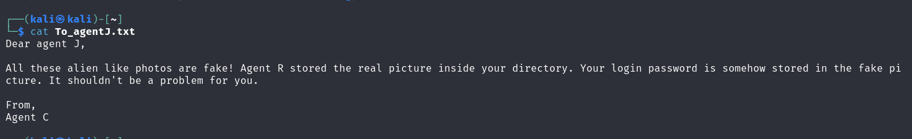
</p>

<p align="center">
<b>Figure.</b> To_agentJ.
</p>


# Image Analysis

The downloaded files suggested that sensitive information was hidden within one of the images.

---

## Metadata Analysis

### Why ExifTool?

ExifTool extracts metadata from files and can reveal abnormal structures or hidden content.

### Command

```bash
exiftool cutie.png
```

### Observation

The output indicated additional data after the PNG IEND chunk.

<p align="center">
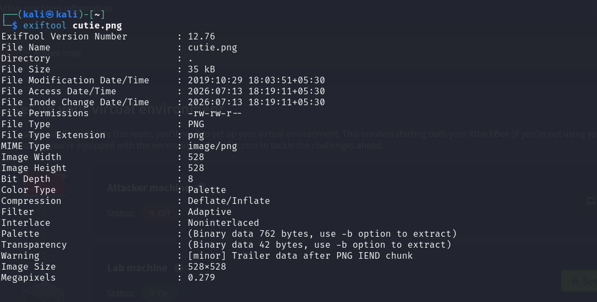
</p>

<p align="center">
<b>Figure.</b> metadata analysis.
</p>


---

## String Extraction

### Why strings?

The `strings` utility extracts readable ASCII text from binary files, often revealing embedded information.

### Command

```bash
strings cutie.png
```

<p align="center">
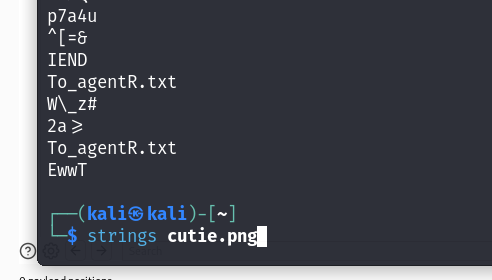
</p>

<p align="center">
<b>Figure.</b> Strings Analysis.
</p>


---

## Embedded File Detection

### Why Binwalk?

Binwalk scans binary files to identify embedded files, compressed archives, or appended data.

### Command

```bash
binwalk cutie.png
```

<p align="center">
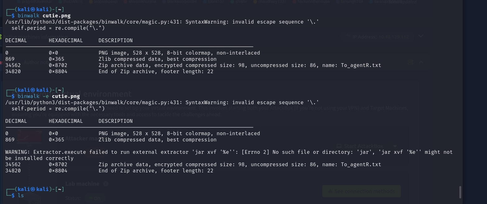
</p>

<p align="center">
<b>Figure.</b> Binwalk Scan.
</p>


---

## Password Hash Extraction

### Why zip2john?

The embedded archive was password protected.

`zip2john` extracts password hashes into a format compatible with John the Ripper.

### Command

```bash
zip2john <archive.zip> > hash.txt
```

### Password Recovery

The recovered archive password was:

```
alien
```
<p align="center">
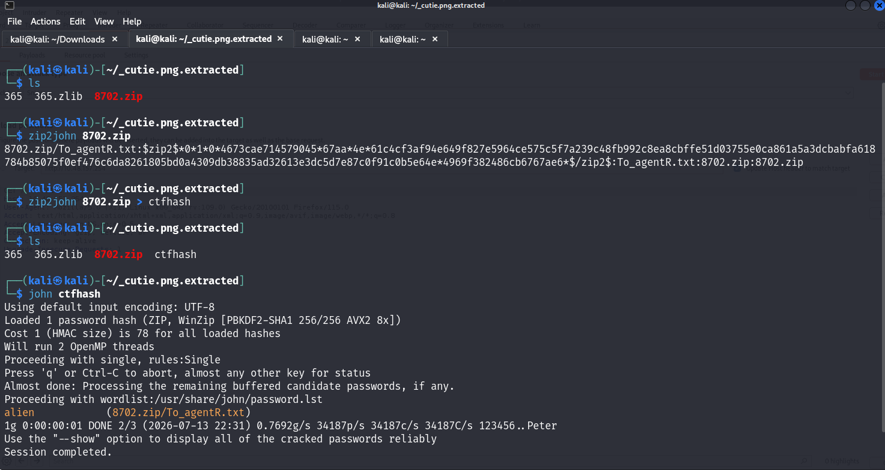
</p>

<p align="center">
<b>Figure.</b> Password Extraction.
</p>

---

## Archive Extraction

### Why 7z?

7-Zip supports extraction of encrypted archives after providing the recovered password.

### Command

```bash
7z x <archive.zip>
```

Password:

```
alien
```

<p align="center">
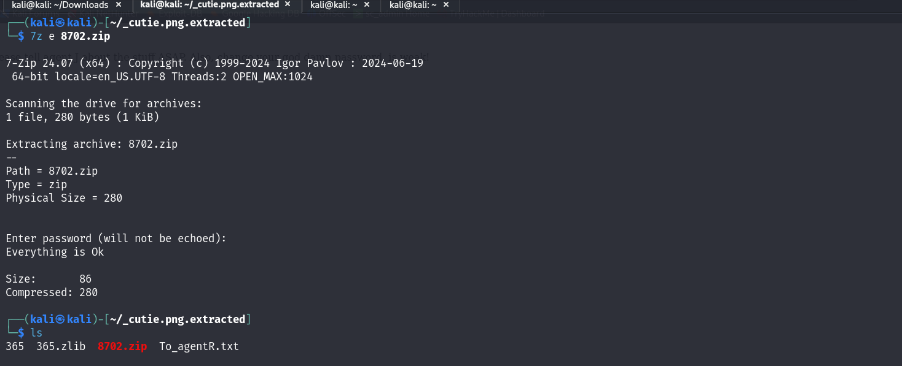
</p>

<p align="center">
<b>Figure.</b> Password Extraction.
</p>


---

# Decoding Hidden Data

The extracted content contained Base64 encoded data.

### Why Base64?

Base64 is an encoding scheme commonly used to store binary information as readable text.

### Command

```bash
base64 -d <file>
```

### Result

```
Area51
```

This value appeared to be a passphrase for the remaining image.


<p align="center">
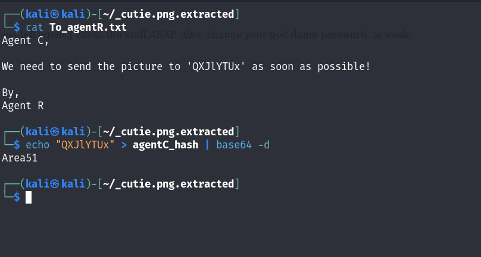
</p>

<p align="center">
<b>Figure.</b> Encrypted Text File.
</p>

---

# Steganography Analysis

The second image (`cute-alien.jpg`) was inspected.

### Initial Verification

### Command

```bash
head cute-alien.jpg
```

The output began with:

```
JFIF
```

confirming it was a valid JPEG image.

<p align="center">
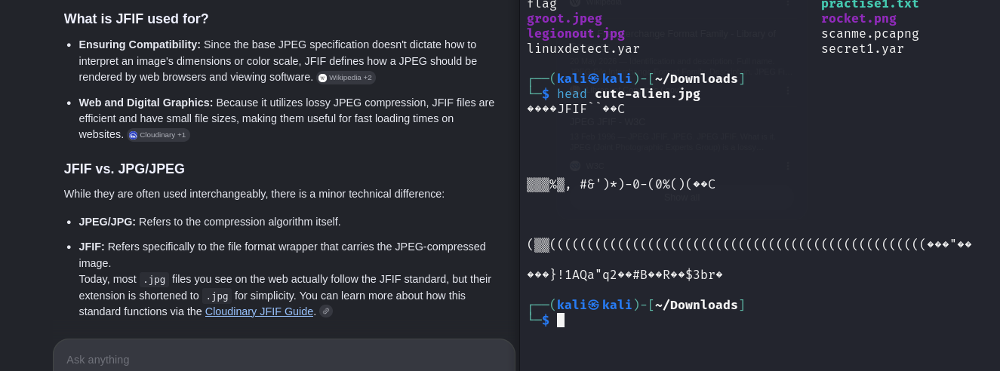
</p>

<p align="center">
<b>Figure.</b> JFIF format.
</p>

---

## Hidden File Extraction

### Why Steghide?

Steghide extracts files embedded inside images using steganography.

### Command

```bash
steghide extract -sf cute-alien.jpg
```

Passphrase:

```
Area51
```

### Result

A hidden file named:

```
message.txt
```

was extracted.

<p align="center">
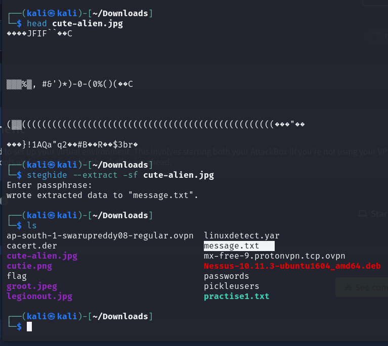
</p>

<p align="center">
<b>Figure.</b> File Extraction.
</p>

---

# Credential Recovery

The extracted message contained SSH credentials.

```
Hi James,

Glad you find this message.
Your login password is hackerrules!

Your buddy,
Chris
```

These credentials were used to access the target as **James**.

<p align="center">
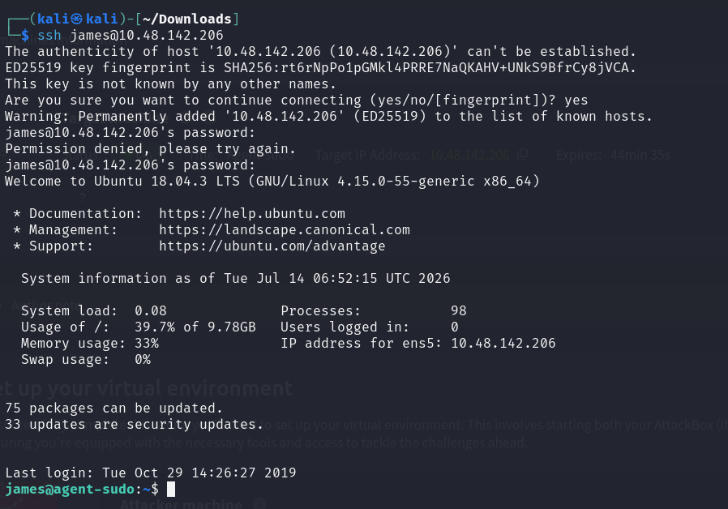
</p>

<p align="center">
<b>Figure.</b> James User Login.
</p>

<p align="center">
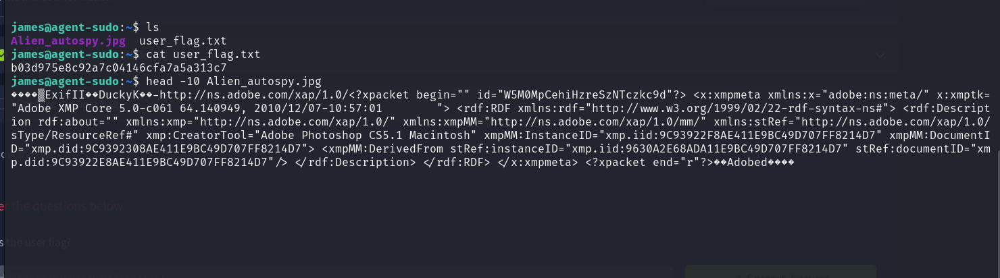
</p>

<p align="center">
<b>Figure.</b> user flag detection.
</p>

---

# Privilege Escalation

After logging in as James, sudo permissions were enumerated.

### Command

```bash
sudo -l
```

### Result

```
(ALL, !root) /bin/bash
```
<p align="center">
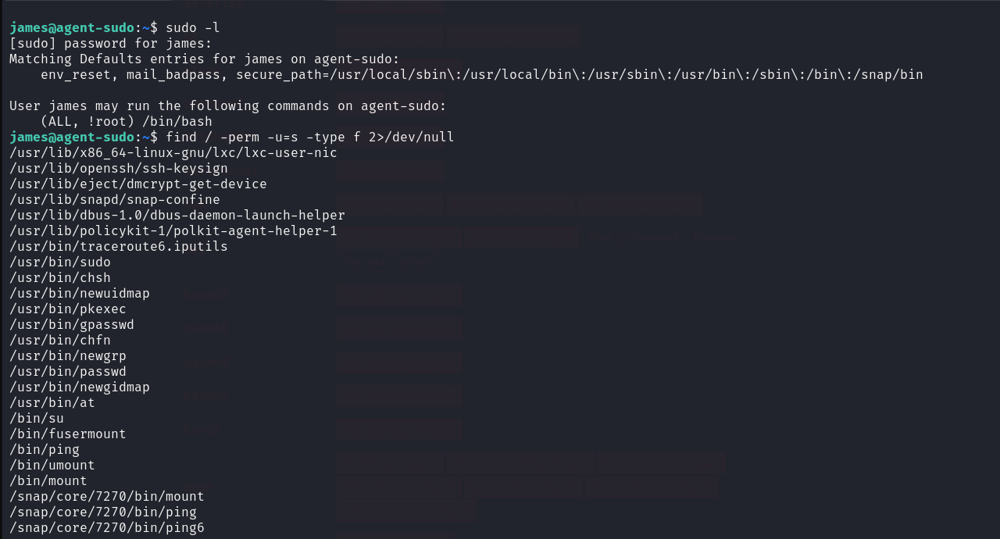
</p>

<p align="center">
<b>Figure.</b> Priviledge Escalation Demonstration.
</p>

### Why sudo -l?

This command lists commands the current user is permitted to execute via sudo and often reveals privilege escalation opportunities.

The discovered configuration was researched and matched a known privilege escalation technique.

Reference:

- ExploitDB

<p align="center">
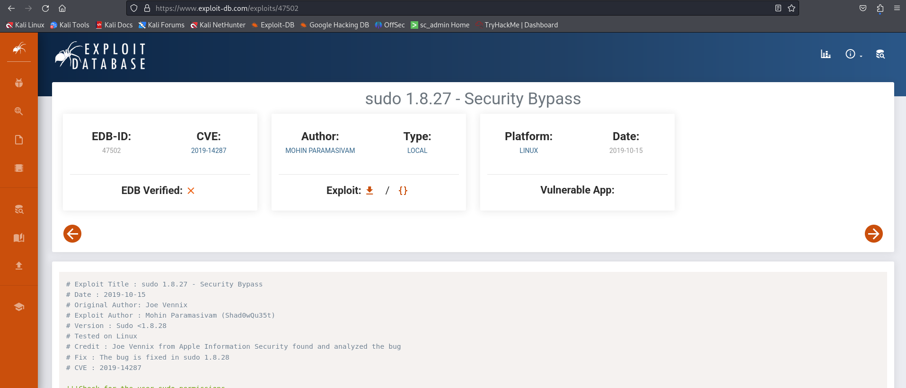
</p>

<p align="center">
<b>Figure.</b> Exploit DB Search.
</p>

<p align="center">
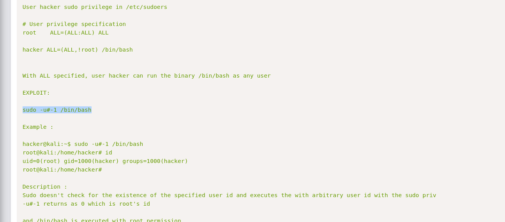
</p>

<p align="center">
<b>Figure.</b> ExploitDB Technique.
</p>
---

# Root Access

The identified sudo misconfiguration was exploited using the corresponding privilege escalation technique.

### Command

```bash
<Privilege Escalation Command>
```

### Result

Root shell obtained successfully.

<p align="center">
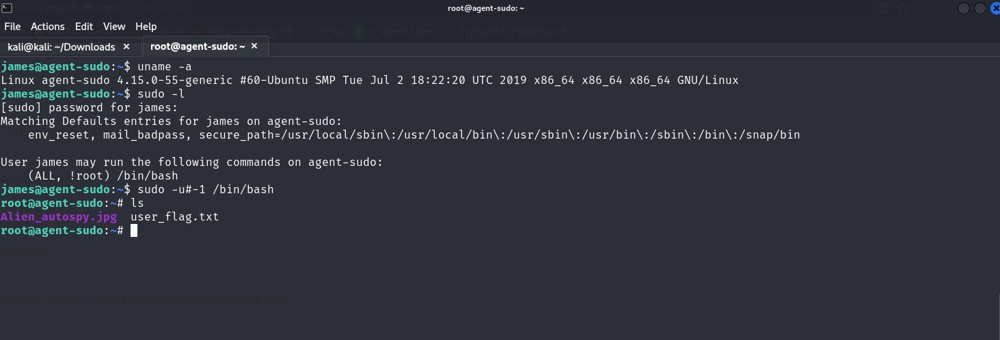
</p>

<p align="center">
<b>Figure.</b> Priviledge Escalation Attained.
</p>

---

# Tools Used

| Tool | Purpose |
|------|---------|
| Nmap | Network discovery, port scanning and service enumeration |
| Burp Suite | Intercepting and modifying HTTP requests |
| Hydra | Online password brute forcing |
| FTP | File retrieval from the FTP server |
| ExifTool | Metadata analysis |
| strings | Extraction of readable strings from binary files |
| Binwalk | Detection of embedded files and archives |
| zip2john | Extracting password hashes from ZIP archives |
| 7-Zip | Extracting encrypted archives |
| Base64 | Decoding encoded data |
| Steghide | Extracting hidden files embedded inside images |
| sudo | Enumerating executable commands for privilege escalation |

---

# Skills Demonstrated

- Network Enumeration
- HTTP Request Manipulation
- FTP Enumeration
- Password Brute Forcing
- Metadata Analysis
- Binary File Inspection
- Archive Password Recovery
- Base64 Decoding
- Steganography Analysis
- SSH Authentication
- Linux Privilege Escalation
