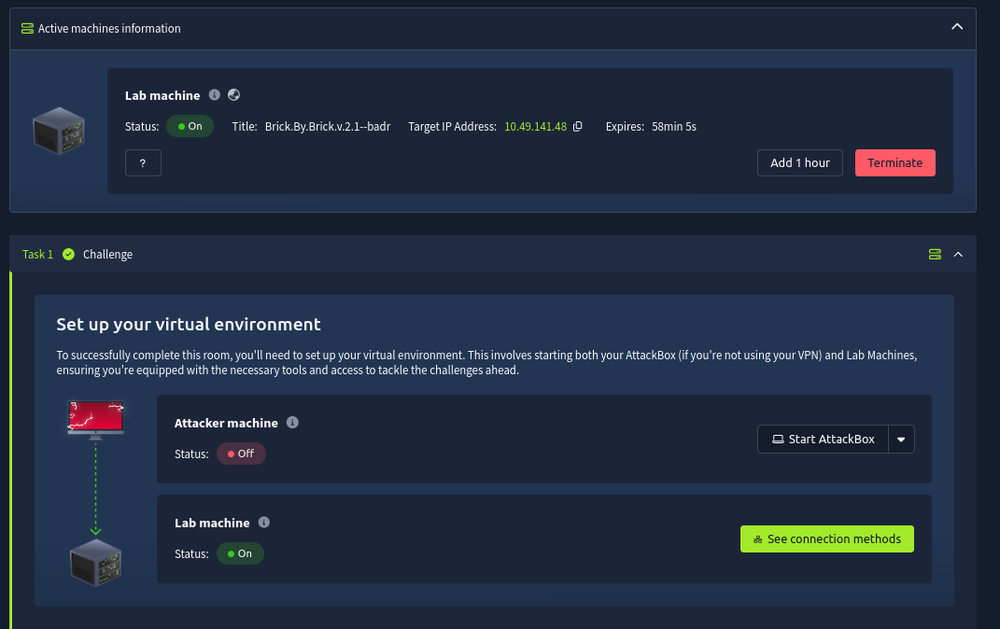
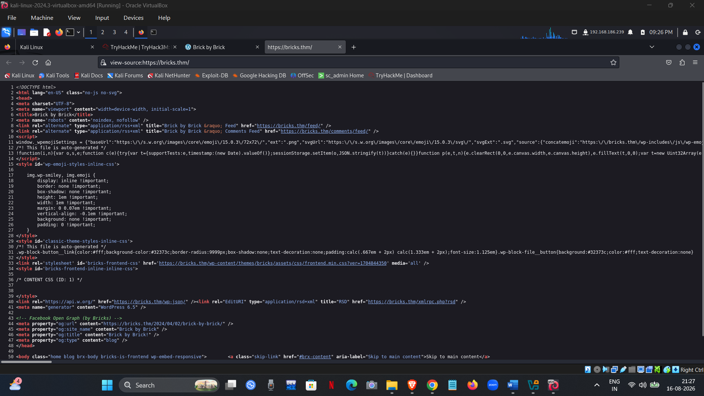

# TryHackMe — Bricks Heist

> **Room:** Bricks Heist  
> **Difficulty:** Beginner  
> **Platform:** TryHackMe  
> **Focus:** Web enumeration, WordPress reconnaissance, vulnerability identification, RCE, Linux enumeration, persistence investigation, cryptocurrency-miner analysis

---

## 1. Approach

I approached this room from two perspectives:

- 🔴 **Attacker:** How can I move from an exposed web application to system access?
- 🔵 **Defender:** What could have prevented, detected, or helped investigate each stage?

The main attack path was:

```text
Target
  ↓
Service Enumeration
  ↓
WordPress Discovery
  ↓
WPScan
  ↓
Bricks Builder 1.9.5
  ↓
CVE-2024-25600
  ↓
Remote Code Execution
  ↓
Interactive Shell
  ↓
Host Enumeration
  ↓
Suspicious Service
  ↓
Cryptocurrency Miner
  ↓
Wallet IOC
  ↓
Threat Intelligence
```

> **Lab note:** All testing was performed against the TryHackMe lab environment. Do not use these techniques against systems without authorization.

---

# 2. Target Setup

The room provided the target IP:

```text
10.49.141.48
```

The application expects the hostname `bricks.thm`, so I mapped the hostname locally.

```bash
sudo nano /etc/hosts
```

Added:

```text
10.49.141.48    bricks.thm
```

This allowed the browser and command-line tools to resolve `bricks.thm` to the lab target.


### Attacker thinking

The first goal was not exploitation. It was simply to make the target accessible and reduce the unknowns.

---

# 3. Initial Enumeration

## 3.1 Port and Service Enumeration

I started with Nmap to identify exposed services.

```bash
nmap 10.49.141.48
```

The scan revealed:

| Port | Service | Why it matters |
|---|---|---|
| 22/tcp | SSH | Possible remote access |
| 80/tcp | HTTP | Web attack surface |
| 443/tcp | HTTPS | Secure web application |
| 3306/tcp | MySQL | Database exposure |



### Attacker thinking

The HTTP/HTTPS services immediately stood out as the main attack surface.

The next question became:

> **What technology is running behind the web server?**

### Defender thinking

An internet-facing service increases attack surface.

A defender should know:

- Which services are exposed?
- Why are they exposed?
- Are they required?
- Are they patched?
- Are unnecessary services accessible externally?

---

# 4. Web Application Enumeration

Opening the website revealed the **Bricky by Bricky** application.


I then checked accessible files such as `robots.txt`.

It contained:

```text
User-agent: *
Disallow: /wp-admin/
Allow: /wp-admin/admin-ajax.php
```


The presence of `/wp-admin/` and other WordPress indicators suggested that the application was running WordPress.

### Attacker thinking

This was a useful fingerprint.

Instead of blindly testing the web application, I could now switch to **WordPress-specific enumeration**.

### Defender thinking

Publicly exposed application information can help attackers fingerprint the technology stack.

Useful controls include:

- Minimize unnecessary information disclosure.
- Keep applications and components updated.
- Remove unused plugins/themes.
- Monitor exposed administrative interfaces.

---

# 5. Confirming WordPress

The WordPress login page was accessible.


This confirmed the WordPress installation and justified using WordPress-specific enumeration tools.

---

# 6. WordPress Enumeration with WPScan

I used WPScan to identify the WordPress version, theme, and other useful information.

The first scan did not complete normally because of the target's TLS configuration.

I repeated the scan with TLS certificate verification disabled:

```bash
wpscan --url https://bricks.thm --disable-tls-checks
```




> **Note:** Disabling TLS verification can be useful in a controlled lab with an untrusted/self-signed certificate. It should not be treated as a general solution for TLS problems.

---

# 7. Identifying the Vulnerable Component

WPScan identified:

- **WordPress:** 6.5
- **Theme:** Bricks
- **Bricks version:** 1.9.5


The Bricks version became the most important finding.

### Attacker thinking

Version information can turn a large attack surface into a very specific research question:

> **Is this exact version affected by a known vulnerability?**

---

# 8. Vulnerability Research

The identified Bricks Builder version was associated with:

> **CVE-2024-25600 — Bricks Builder Remote Code Execution**

The vulnerability provides a path to remote command execution on a vulnerable installation.


### Why this mattered

The attack path changed from:

```text
Unknown Web Application
        ↓
Many possible attack paths
```

to:

```text
Bricks 1.9.5
        ↓
Known vulnerability
        ↓
CVE-2024-25600
        ↓
Potential RCE
```

This was one of the main lessons from the room:

> **Good enumeration reduces guesswork.**

### Defender thinking

The same information is valuable defensively.

If an organization maintains:

- asset inventory
- software/version inventory
- vulnerability scanning
- patch management

then vulnerable internet-facing software can be identified before an attacker finds it.

---

# 9. Exploitation

I used the identified exploit against the vulnerable WordPress installation.

The exploit:

1. Checked the target.
2. Confirmed the vulnerable condition.
3. Started the exploitation process.
4. Provided an interactive shell.


The shell changed the investigation from **web application enumeration** to **host-level enumeration**.

```text
Web Application
      ↓
Remote Code Execution
      ↓
Operating System Access
      ↓
Host Investigation
```

### Defender thinking

An RCE does not have to remain invisible.

Depending on available telemetry, useful signals may include:

- unusual HTTP requests
- unexpected web-server behavior
- web server spawning a shell
- abnormal child processes
- suspicious outbound connections
- unexpected file creation

A particularly useful behavioral signal would be:

```text
Web Server
    ↓
Unexpected Shell
    ↓
Command Execution
```

---

# 10. First Flag

Once the shell was obtained, I listed the current directory:

```bash
ls
```

A flag file was present and its contents were read:

```bash
cat <flag-file>.txt
```

The first flag was:

```text
THM{fl46_650c844110baced87e1606453b93f22a}
```


At this point, I deliberately did not treat the shell as the end of the investigation.

> **Initial access is the beginning of post-exploitation investigation, not the end of the attack.**

---

# 11. Post-Exploitation Investigation

## 11.1 Investigating Running Services

The next objective was to understand what was running on the compromised system.

I enumerated active systemd services:

```bash
systemctl list-units --type=service --state=running
```

A suspicious service named:

```text
ubuntu.service
```

was identified.


### Attacker thinking

A suspicious service can be an important lead because it may explain how an unexpected process is being launched.

### Defender thinking

Unexpected service creation or modification can be a useful detection opportunity.

Questions a defender should ask:

- When was the service created?
- Who created or modified it?
- What does it execute?
- Which user does it run as?
- Does the service belong to legitimate software?

---

# 12. Inspecting the Suspicious Service

I inspected the service definition:

```bash
systemctl cat ubuntu.service
```

The relevant configuration showed:

```text
[Service]
Type=simple
ExecStart=/lib/NetworkManager/nm-inet-dialog
Restart=on-failure
```

The service was launching:

```text
nm-inet-dialog
```


The suspicious executable was located at:

```text
/lib/NetworkManager/nm-inet-dialog
```


### Investigation lesson

The useful pattern here was:

```text
Suspicious Process
      ↓
Find How It Starts
      ↓
Inspect Service
      ↓
Find Executable
      ↓
Investigate Executable
```

This is more useful than simply recording the service name as an answer.

---

# 13. Investigating the Cryptocurrency Miner

The investigation then moved toward the miner configuration/log information.

The relevant file was:

```text
/lib/NetworkManager/inet.conf
```

It contained miner-related information such as:

```text
Bitcoin Miner thread Started
Status: Mining!
Miner()
```


This provided evidence that cryptocurrency-mining activity was running on the host.

### Defender thinking

Unexpected mining activity can produce several useful signals:

- unusual CPU usage
- unexpected processes
- suspicious binaries
- unusual network connections
- mining-pool communication
- unexpected services
- suspicious files/configuration

A defender should investigate the **cause**, not just terminate the miner.

---

# 14. Extracting the Wallet IOC

The miner configuration contained encoded wallet information.

I used CyberChef's **Magic** operation to decode it.


The result was a cryptocurrency wallet address.

### Why this mattered

The wallet became an **IOC — Indicator of Compromise**.

Instead of treating it as another room answer, I treated it as an investigation pivot.

```text
Miner
  ↓
Configuration
  ↓
Wallet Address
  ↓
Threat Intelligence
```

---

# 15. Threat Intelligence Investigation

I then investigated the decoded cryptocurrency address using blockchain/search resources.


The investigation connected the address with the threat actor information referenced by the room.


The room identified the address as being associated with the **LockBit ransomware group**.

> **Important:** A wallet address is a useful correlation point, but an IOC by itself should not automatically be treated as definitive attribution. Attribution should be based on multiple pieces of evidence.

---

# 16. Attack-to-Investigation Timeline

The complete chain can be viewed as:

```text
External Exposure
      ↓
Nmap Enumeration
      ↓
WordPress Discovery
      ↓
WPScan
      ↓
Bricks Builder 1.9.5
      ↓
CVE-2024-25600
      ↓
Remote Code Execution
      ↓
Interactive Shell
      ↓
First Flag
      ↓
Suspicious systemd Service
      ↓
nm-inet-dialog
      ↓
Miner Configuration
      ↓
Encoded Wallet
      ↓
CyberChef Decoding
      ↓
Blockchain Investigation
      ↓
LockBit Association
```

This shows two different phases:

### 🔴 Attack

```text
Enumerate → Identify → Research → Exploit
```

### 🔵 Investigation

```text
Enumerate → Identify → Correlate → Investigate
```

---

# 17. Defender Perspective

The same attack chain can be translated into defensive controls.

| Attacker activity | Prevention | Detection opportunity |
|---|---|---|
| Web enumeration | Reduce unnecessary exposure | Web/WAF logs |
| Vulnerable Bricks version | Patch management | Vulnerability scanning |
| RCE attempt | Patch + application hardening | Suspicious HTTP/process activity |
| Shell execution | Least privilege | Process creation telemetry |
| Malicious service | Restrict service changes | Service creation/modification logs |
| Miner execution | Application/server hardening | CPU/process anomalies |
| Mining communication | Network controls | DNS/network telemetry |
| Wallet IOC | Threat intelligence | IOC correlation |

---

# 18. What Could Have Prevented the Attack?

### 1. Patch Management

Keep internet-facing applications and components updated.

The vulnerable Bricks version should not remain exposed once a security fix is available.

### 2. Asset and Version Inventory

Maintain visibility into:

- applications
- plugins/themes
- versions
- internet-facing systems
- known vulnerabilities

### 3. Least Privilege

A compromised web application should have only the permissions it needs.

### 4. Reduce Attack Surface

Remove unnecessary services and restrict administrative interfaces.

### 5. Centralized Logging

Collect web, system, authentication, process, and network telemetry so that suspicious activity can be investigated.

---

# 19. What Could Have Detected the Attack?

The most useful detection idea from this room is **behavioral correlation**.

Instead of detecting one event in isolation:

```text
Suspicious HTTP request
```

look for a chain such as:

```text
Web Server
    ↓
Unexpected Shell
    ↓
Command Execution
    ↓
Unknown Binary
    ↓
New/Unexpected Service
    ↓
Outbound Mining Connection
```

This type of correlation can provide much stronger investigation leads.

### SIEM perspective

If equivalent telemetry were available in a SIEM such as Wazuh, I would look for:

- suspicious process creation
- unexpected parent/child processes
- service creation/modification
- suspicious file changes
- unusual outbound connections
- known IOCs
- abnormal resource usage

> **Note:** This room was not monitored by my Wazuh deployment. These are defensive detection opportunities derived from the attack path, not detections I actually implemented during the room.

---

# 20. Incident Response Perspective

If this were a real compromised server, the response should not simply be:

```text
Kill miner → Delete file → Done
```

A better approach would be:

```text
Detect
  ↓
Validate
  ↓
Contain
  ↓
Collect Evidence
  ↓
Eradicate
  ↓
Recover
  ↓
Monitor
```

### Contain

- Isolate the affected host where appropriate.
- Restrict malicious network communication.
- Prevent further attacker activity.

### Investigate

- Preserve relevant logs.
- Identify suspicious processes and services.
- Determine the initial access path.
- Search for additional IOCs.
- Build a timeline.

### Eradicate

- Remove malicious components.
- Patch the vulnerable application.
- Review persistence mechanisms.
- Rotate potentially compromised credentials.

### Recover

- Restore from a trusted state when required.
- Validate system integrity.
- Increase monitoring after recovery.

---

# 21. Attacker vs Defender

| Attacker asks | Defender asks |
|---|---|
| What is exposed? | Why is it exposed? |
| What technology is running? | Is it supported and patched? |
| Which version is installed? | Are vulnerable versions tracked? |
| Can I exploit it? | Can exploitation be detected? |
| Can I execute commands? | Why did the web server spawn a shell? |
| What processes are running? | Which processes are abnormal? |
| What service starts it? | Who created or modified the service? |
| What is the miner doing? | How would unauthorized mining be detected? |
| What is the wallet? | Can the IOC be correlated with other evidence? |

> **The goal is not to choose between attacker and defender thinking. It is to understand both.**

---

# 22. What I Learned

### Technical

- Service enumeration helps define the attack surface.
- Technology fingerprinting helps select the right enumeration tools.
- Version enumeration can reveal known attack paths.
- CVE research is more useful when connected to the exact software/version found.
- Getting a shell is not the end of an investigation.
- Suspicious processes should lead to questions about their parent process, executable, and persistence.
- Configuration files can contain valuable forensic evidence.
- IOCs can be used as pivots for threat intelligence.

### Defensive

- Patch management can remove entire attack paths.
- Least privilege can reduce the impact of application compromise.
- Unexpected services and processes can provide strong investigation leads.
- Centralized telemetry is essential for post-compromise investigation.
- Behavioral correlation can be more useful than isolated indicators.

### Personal learning

The biggest lesson from this room was:

> **Initial access is only the beginning.**

I started by thinking like an attacker:

> *What can I discover and exploit?*

After gaining access, I changed the question:

> *If this were a real compromised server, what evidence would tell me what happened?*

That shift from **exploitation to investigation** was the most valuable part of this room for me.

---

# 23. Tools Used

| Tool | Purpose |
|---|---|
| Nmap | Port and service enumeration |
| Browser | Web reconnaissance |
| WPScan | WordPress enumeration |
| CyberChef | Decoding wallet information |
| Blockchain explorer | Cryptocurrency address investigation |
| Linux shell | Post-exploitation enumeration |
| systemctl | Service investigation |

---

# 24. Flags

### Flag 1

```text
THM{fl46_650c844110baced87e1606453b93f22a}
```

---

# Conclusion

Bricks Heist gave me a useful example of how an attack can progress from **web reconnaissance to application exploitation and then into host-level investigation**.

The most important lesson was not simply finding a vulnerable component or obtaining a shell.

It was learning to connect:

```text
Attack
  ↓
Evidence
  ↓
Investigation
  ↓
Detection
  ↓
Defense
```

My takeaway from the room is simple:

> **A good attacker asks, "What can I exploit?"**  
> **A good defender asks, "How would I know this happened?"**  
> **A strong security practitioner learns to ask both.**

---

## References

- [TryHackMe — Bricks Heist](https://tryhackme.com/room/tryhack3mbricksheist)
- [NIST NVD — CVE-2024-25600](https://nvd.nist.gov/vuln/detail/CVE-2024-25600)
- [Bricks Builder](https://bricksbuilder.io/)

> **Disclaimer:** This write-up documents my learning process in a controlled TryHackMe environment. The techniques described here should only be used against systems you own or have explicit permission to assess.
