# TryHackMe — Bricks Heist Write-up

> **Room:** Bricks Heist  
> **Difficulty:** Beginner  
> **Platform:** TryHackMe  
> **Focus:** Web enumeration, WordPress reconnaissance, vulnerability identification, RCE, Linux enumeration, persistence investigation, cryptocurrency-miner analysis

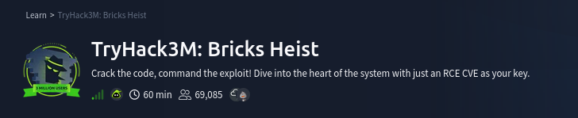

---

## 1. Approach

I approached this room from two perspectives:

- 🔴 **Attacker:** How can I move from an exposed web application to system access?
- 🔵 **Defender:** What could have prevented, detected, or helped investigate each stage?

> **My methodology:** Observe → Question → Test → Interpret → Defend

The main attack path was:

```text
Target
  ↓
Service Enumeration
  ↓
WordPress Discovery
  ↓
WPScan
  ↓
Bricks Builder 1.9.5
  ↓
CVE-2024-25600
  ↓
Remote Code Execution
  ↓
Interactive Shell
  ↓
Host Enumeration
  ↓
Suspicious Service
  ↓
Cryptocurrency Miner
  ↓
Wallet IOC
  ↓
Threat Intelligence
```

> **Lab note:** All testing was performed against the TryHackMe lab environment. Do not use these techniques against systems without authorization.

---

# 2. Target Setup

The room provided the target IP:

```text
10.49.141.48
```

The application expects the hostname `bricks.thm`, so I mapped the hostname locally.

```bash
sudo nano /etc/hosts
```

Added:

```text
10.49.141.48    bricks.thm
```
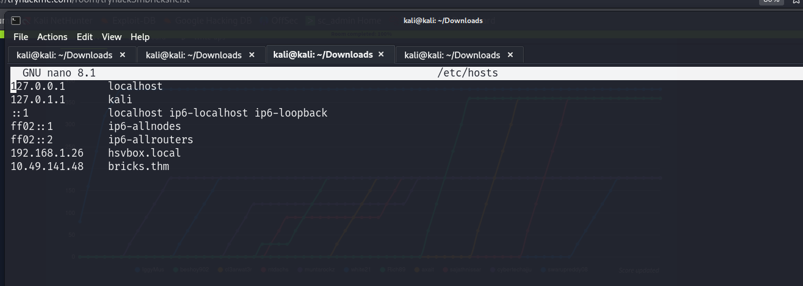

This allowed the browser and command-line tools to resolve `bricks.thm` to the lab target.

### Attacker thinking

The first goal was not exploitation. It was simply to make the target accessible and reduce the unknowns.

---

# 3. Initial Enumeration

## 3.1 Port and Service Enumeration

I started with Nmap to identify exposed services.

```bash
nmap 10.49.141.48
```
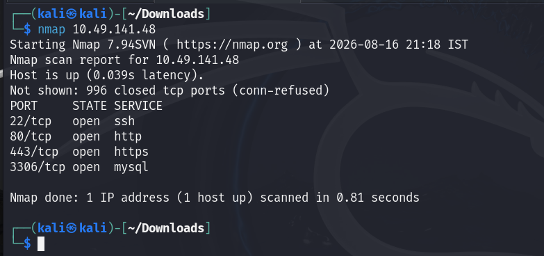

The scan revealed:

| Port | Service | Why it matters |
|---|---|---|
| 22/tcp | SSH | Possible remote access |
| 80/tcp | HTTP | Web attack surface |
| 443/tcp | HTTPS | Secure web application |
| 3306/tcp | MySQL | Database exposure |


### Attacker thinking

The HTTP/HTTPS services immediately stood out as the main attack surface.

The next question became:

> **What technology is running behind the web server?**

### Defender thinking

An internet-facing service increases attack surface.

A defender should know:

- Which services are exposed?
- Why are they exposed?
- Are they required?
- Are they patched?
- Are unnecessary services accessible externally?

---

# 4. Web Application Enumeration

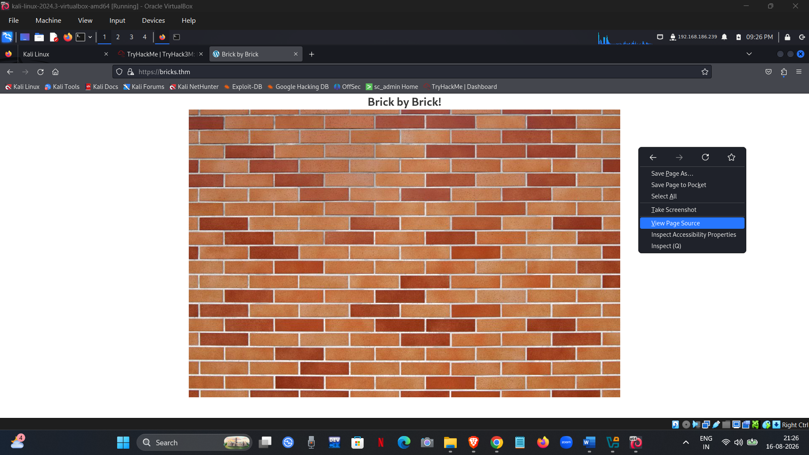

Opening the website revealed the **Brick by Brick** application.

I then checked accessible files such as `robots.txt`.

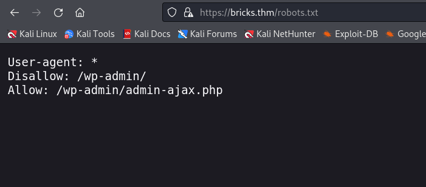

It contained:

```text
User-agent: *
Disallow: /wp-admin/
Allow: /wp-admin/admin-ajax.php
```


The presence of `/wp-admin/` and other WordPress indicators suggested that the application was running WordPress.

### Attacker thinking

This was a useful fingerprint.

Instead of blindly testing the web application, I could now switch to **WordPress-specific enumeration**.

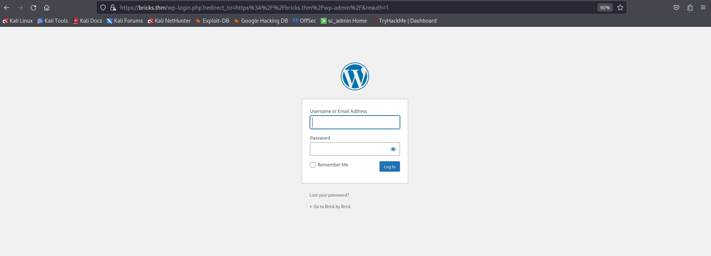


### Defender thinking

Publicly exposed application information can help attackers fingerprint the technology stack.

Useful controls include:

- Minimize unnecessary information disclosure.
- Keep applications and components updated.
- Remove unused plugins/themes.
- Monitor exposed administrative interfaces.

---

# 5. Confirming WordPress

The WordPress login page was accessible.


This confirmed the WordPress installation and justified using WordPress-specific enumeration tools.

---

# 6. WordPress Enumeration with WPScan

I used WPScan to identify the WordPress version, theme, and other useful information.

The first scan did not complete normally because of the target's TLS configuration.

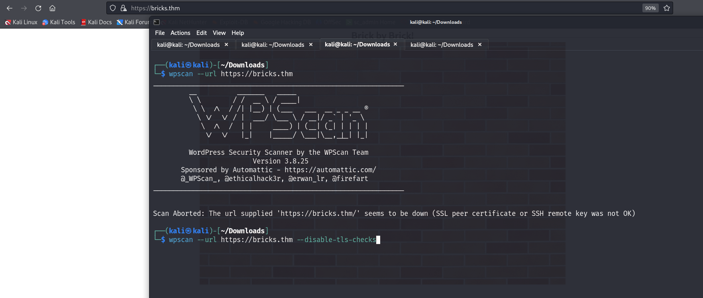

I repeated the scan with TLS certificate verification disabled:

```bash
wpscan --url https://bricks.thm --disable-tls-checks
```

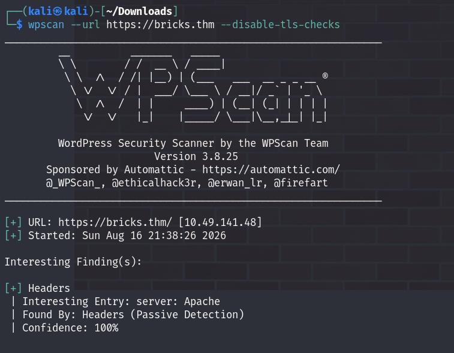

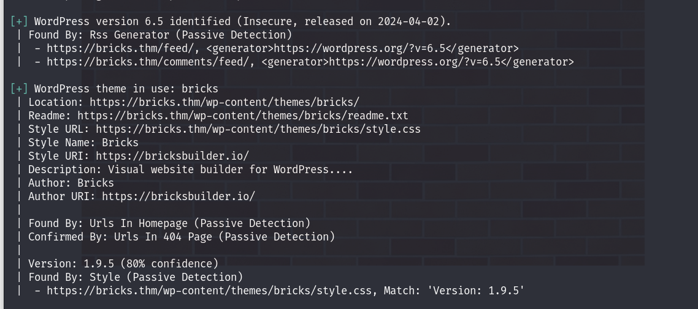

> **Note:** Disabling TLS verification can be useful in a controlled lab with an untrusted/self-signed certificate. It should not be treated as a general solution for TLS problems.

---

# 7. Identifying the Vulnerable Component

WPScan identified:

- **WordPress:** 6.5
- **Theme:** Bricks
- **Bricks version:** 1.9.5

The Bricks version became the most important finding.

### Attacker thinking

Version information can turn a large attack surface into a very specific research question:

> **Is this exact version affected by a known vulnerability?**

---

# 8. Vulnerability Research

The identified Bricks Builder version was associated with:

> **CVE-2024-25600 — Bricks Builder Remote Code Execution**

The vulnerability provides a path to remote command execution on a vulnerable installation.

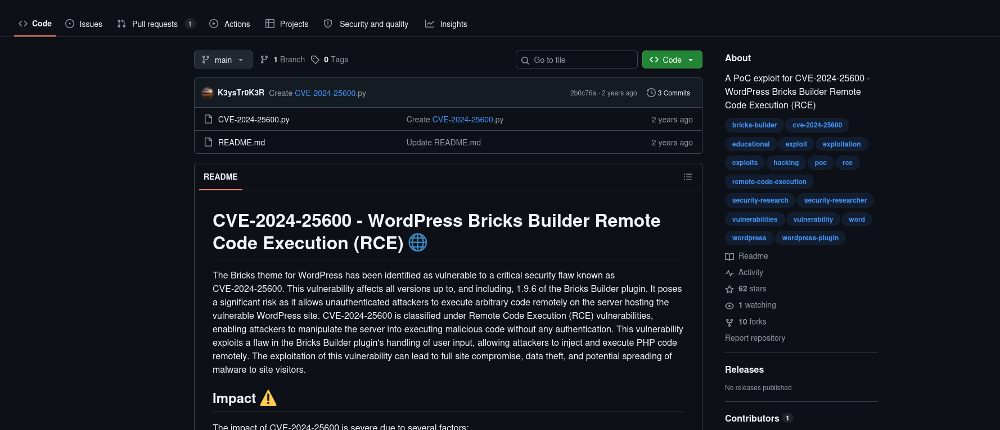

### Why this mattered

The attack path changed from:

```text
Unknown Web Application
        ↓
Many possible attack paths
```

to:

```text
Bricks 1.9.5
        ↓
Known vulnerability
        ↓
CVE-2024-25600
        ↓
Potential RCE
```

This was one of the main lessons from the room:

> **Good enumeration reduces guesswork.**

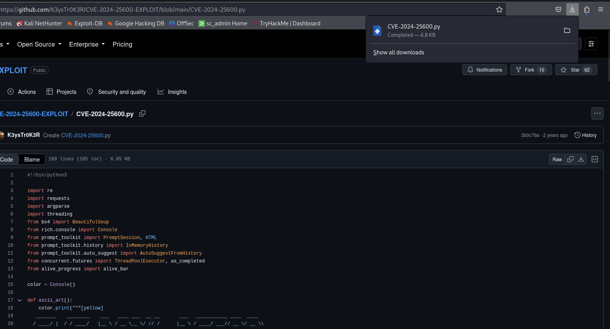

### Defender thinking

The same information is valuable defensively.

If an organization maintains:

- asset inventory
- software/version inventory
- vulnerability scanning
- patch management

then vulnerable internet-facing software can be identified before an attacker finds it.

---

# 9. Exploitation

I used the identified exploit against the vulnerable WordPress installation.

The exploit:

1. Checked the target.
2. Confirmed the vulnerable condition.
3. Started the exploitation process.
4. Provided an interactive shell.

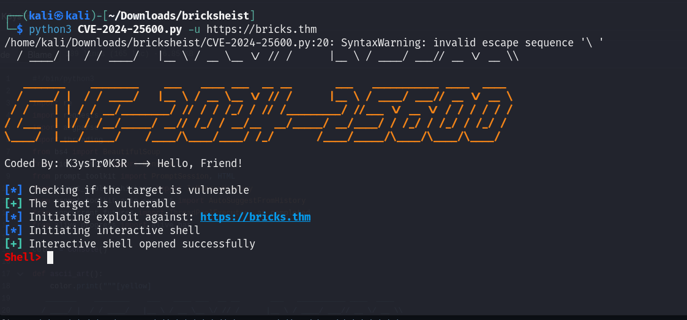

The shell changed the investigation from **web application enumeration** to **host-level enumeration**.

```text
Web Application
      ↓
Remote Code Execution
      ↓
Operating System Access
      ↓
Host Investigation
```

### Defender thinking

An RCE does not have to remain invisible.

Depending on available telemetry, useful signals may include:

- unusual HTTP requests
- unexpected web-server behavior
- web server spawning a shell
- abnormal child processes
- suspicious outbound connections
- unexpected file creation

A particularly useful behavioral signal would be:

```text
Web Server
    ↓
Unexpected Shell
    ↓
Command Execution
```

---

# 10. First Flag

Once the shell was obtained, I listed the current directory:

```bash
ls
```

A flag file was present and its contents were read:

```bash
cat <flag-file>.txt
```

The first flag was:

```text
THM{fl46_650c844110baced87e1606453b93f22a}
```

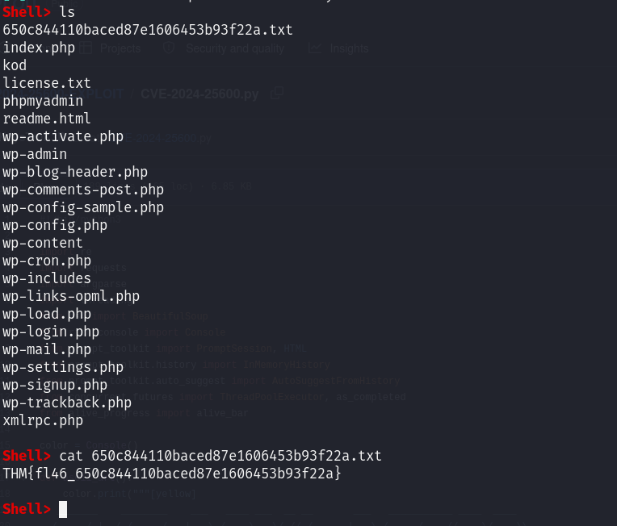


At this point, I deliberately did not treat the shell as the end of the investigation.

> **Initial access is the beginning of post-exploitation investigation, not the end of the attack.**

---

# 11. Post-Exploitation Investigation

## 11.1 Investigating Running Services

The next objective was to understand what was running on the compromised system.

I enumerated active systemd services:

```bash
systemctl list-units --type=service --state=running
```

A suspicious service named:

```text
ubuntu.service
```

was identified.

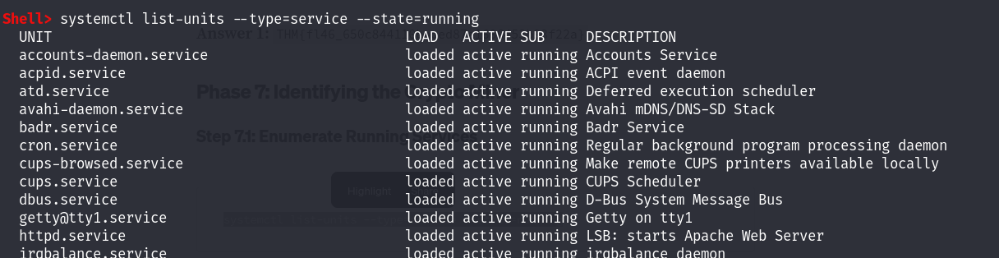

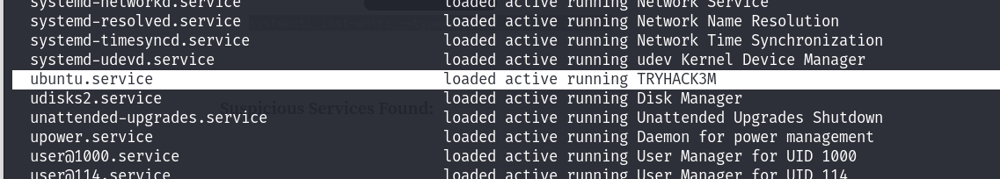

### Attacker thinking

A suspicious service can be an important lead because it may explain how an unexpected process is being launched.

### Defender thinking

Unexpected service creation or modification can be a useful detection opportunity.

Questions a defender should ask:

- When was the service created?
- Who created or modified it?
- What does it execute?
- Which user does it run as?
- Does the service belong to legitimate software?

---

# 12. Inspecting the Suspicious Service

I inspected the service definition:

```bash
systemctl cat ubuntu.service
```

The relevant configuration showed:

```text
[Service]
Type=simple
ExecStart=/lib/NetworkManager/nm-inet-dialog
Restart=on-failure
```

The service was launching:

```text
nm-inet-dialog
```

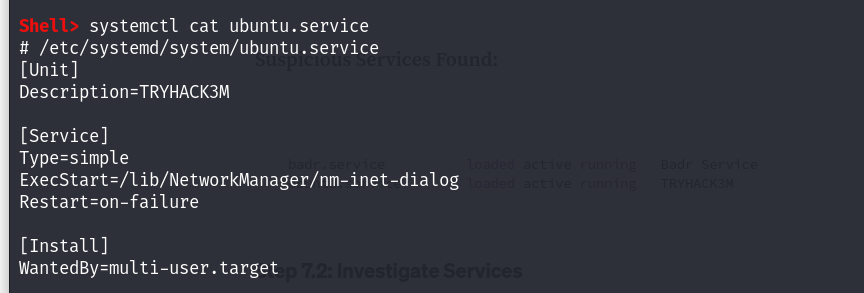

The suspicious executable was located at:

```text
/lib/NetworkManager/nm-inet-dialog
```

### Investigation lesson

The useful pattern here was:

```text
Suspicious Process
      ↓
Find How It Starts
      ↓
Inspect Service
      ↓
Find Executable
      ↓
Investigate Executable
```

This is more useful than simply recording the service name as an answer.

---

# 13. Investigating the Cryptocurrency Miner

The investigation then moved toward the miner configuration/log information.

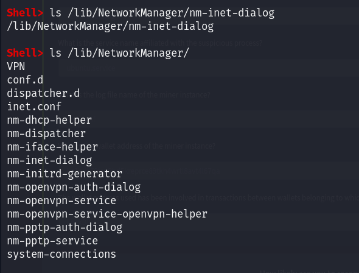

The relevant file was:

```text
/lib/NetworkManager/inet.conf
```

It contained miner-related information such as:

```text
Bitcoin Miner thread Started
Status: Mining!
Miner()
```
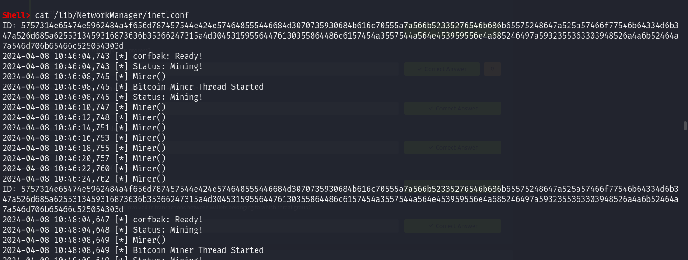

This provided evidence that cryptocurrency-mining activity was running on the host.

### Defender thinking

Unexpected mining activity can produce several useful signals:

- unusual CPU usage
- unexpected processes
- suspicious binaries
- unusual network connections
- mining-pool communication
- unexpected services
- suspicious files/configuration

A defender should investigate the **cause**, not just terminate the miner.

---

# 14. Extracting the Wallet IOC

The miner configuration contained encoded wallet information.

I used CyberChef's **Magic** operation to decode it.

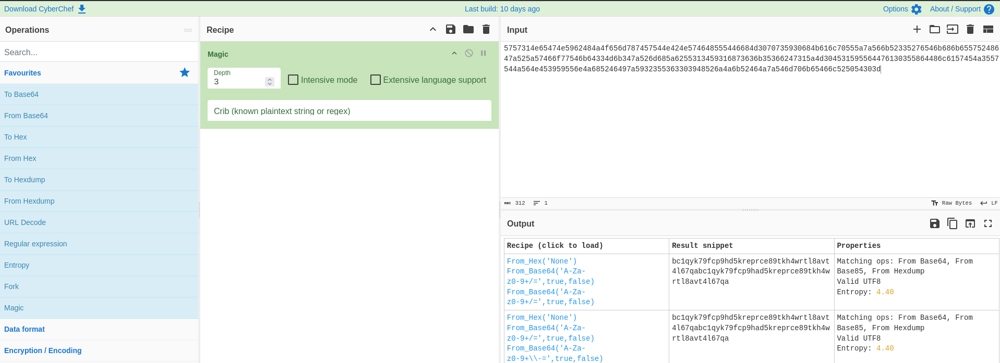

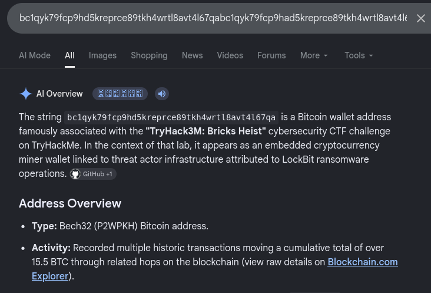

The result was a cryptocurrency wallet address.

### Why this mattered

The wallet became an **IOC — Indicator of Compromise**.

Instead of treating it as another room answer, I treated it as an investigation pivot.

```text
Miner
  ↓
Configuration
  ↓
Wallet Address
  ↓
Threat Intelligence
```

---

# 15. Threat Intelligence Investigation

I then investigated the decoded cryptocurrency address using blockchain/search resources.


The investigation connected the address with the threat actor information referenced by the room.

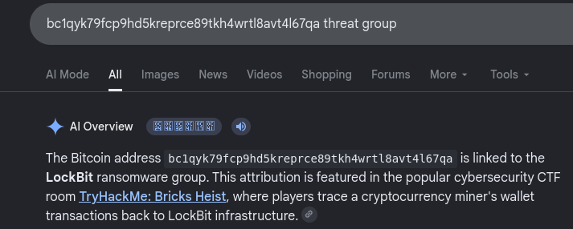

The investigation linked the wallet address to activity associated with LockBit, as referenced by the room.

> **Important:** A wallet address is a useful correlation point, but an IOC by itself should not automatically be treated as definitive attribution. Attribution should be based on multiple pieces of evidence.

---

This shows two different phases:

### 🔴 Attack

```text
Enumerate → Identify → Research → Exploit
```

### 🔵 Investigation

```text
Enumerate → Identify → Correlate → Investigate
```
---

# 16. What Could Have Prevented the Attack?

### 1. Patch Management

Keep internet-facing applications and components updated.

The vulnerable Bricks version should not remain exposed once a security fix is available.

### 2. Asset and Version Inventory

Maintain visibility into:

- applications
- plugins/themes
- versions
- internet-facing systems
- known vulnerabilities

### 3. Least Privilege

A compromised web application should have only the permissions it needs.

### 4. Reduce Attack Surface

Remove unnecessary services and restrict administrative interfaces.

### 5. Centralized Logging

Collect web, system, authentication, process, and network telemetry so that suspicious activity can be investigated.

---

# 18. What Could Have Detected the Attack?

The most useful detection idea from this room is **behavioral correlation**.

### SIEM perspective

If equivalent telemetry were available in a SIEM such as Wazuh, I would look for:

- suspicious process creation
- unexpected parent/child processes
- service creation/modification
- suspicious file changes
- unusual outbound connections
- known IOCs
- abnormal resource usage

> **Note:** This room was not monitored by my Wazuh deployment. These are defensive detection opportunities derived from the attack path, not detections I actually implemented during the room.

---

# 19. Incident Response Perspective

If this were a real compromised server, the response should not simply be:

```text
Kill miner → Delete file → Done
```

A better approach would be:

```text
Detect
  ↓
Validate
  ↓
Contain
  ↓
Collect Evidence
  ↓
Eradicate
  ↓
Recover
  ↓
Monitor
```

### Contain

- Isolate the affected host where appropriate.
- Restrict malicious network communication.
- Prevent further attacker activity.

### Investigate

- Preserve relevant logs.
- Identify suspicious processes and services.
- Determine the initial access path.
- Search for additional IOCs.
- Build a timeline.

### Eradicate

- Remove malicious components.
- Patch the vulnerable application.
- Review persistence mechanisms.
- Rotate potentially compromised credentials.

### Recover

- Restore from a trusted state when required.
- Validate system integrity.
- Increase monitoring after recovery.

---

## 20. One Attack, Two Perspectives

| Stage | 🔴 Attacker | 🔵 Defender |
|---|---|---|
| Reconnaissance | What can I discover? | What is unnecessarily exposed? |
| Enumeration | What technology/version is running? | Is it known and patched? |
| Exploitation | Can I gain access? | Can the attempt be detected? |
| Host Access | What can I find or execute? | What activity is abnormal? |
| Persistence | How can I stay active? | Who created this process/service? |
| Cryptomining | How can I use the host? | Why is the host mining? |
| IOC | What can this evidence reveal? | Where else can this IOC be found? |

> **Every attacker action creates a defensive question. Understanding both perspectives is what turns exploitation knowledge into defensive security thinking.**

---

# 21. What I Learned

### Technical

- Service enumeration helps define the attack surface.
- Technology fingerprinting helps select the right enumeration tools.
- Version enumeration can reveal known attack paths.
- CVE research is more useful when connected to the exact software/version found.
- Getting a shell is not the end of an investigation.
- Suspicious processes should lead to questions about their parent process, executable, and persistence.
- Configuration files can contain valuable forensic evidence.
- IOCs can be used as pivots for threat intelligence.

### Defensive

- Patch management can remove entire attack paths.
- Least privilege can reduce the impact of application compromise.
- Unexpected services and processes can provide strong investigation leads.
- Centralized telemetry is essential for post-compromise investigation.
- Behavioral correlation can be more useful than isolated indicators.

### Personal learning

The biggest lesson from this room was:

> **Initial access is only the beginning.**

I started by thinking like an attacker:

> *What can I discover and exploit?*

After gaining access, I changed the question:

> *If this were a real compromised server, what evidence would tell me what happened?*

That shift from **exploitation to investigation** was the most valuable part of this room for me.

---

# Conclusion

Bricks Heist gave me a useful example of how an attack can progress from **web reconnaissance to application exploitation and then into host-level investigation**.

My takeaway from the room is simple:

> **A good attacker asks, "What can I exploit?"**  
> **A good defender asks, "How would I know this happened?"**  
> **A strong security practitioner learns to ask both.**

---

## References

- [TryHackMe — Bricks Heist](https://tryhackme.com/room/tryhack3mbricksheist)
- [NIST NVD — CVE-2024-25600](https://nvd.nist.gov/vuln/detail/CVE-2024-25600)
- [Bricks Builder](https://bricksbuilder.io/)

> **Disclaimer:** This write-up documents my learning process in a controlled TryHackMe environment. The techniques described here should only be used against systems you own or have explicit permission to assess.
